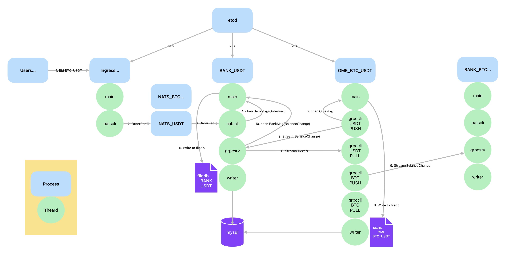

# CCOMS

CCOMS - CryptoCurrency Order Matching System is a high-performance cryptocurrency order matching system designed to handle large volumes of trading data efficiently. It supports real-time order matching, logging, and integration with various databases and message brokers.

**Note:** This project is not ready for production use. It is intended for study and academic purposes only.

[](https://pkg.go.dev/github.com/keng42/ccoms)
[](https://github.com/keng42/ccoms/actions/workflows/release.yml)
[](https://github.com/keng42/ccoms/blob/master/LICENSE)

## Table of Contents

- [Features](#features)
- [Architecture](#architecture)
- [Installation](#installation)
- [Usage](#usage)
- [Configuration](#configuration)
- [Development](#development)
- [Performance](#performance)
- [Contributing](#contributing)
- [License](#license)

## Features

- Real-time order matching
- Integration with MySQL, Redis, NATS and etcd
- High-performance logging and data processing
- Dockerized deployment
- Comprehensive test coverage

## Architecture

CCOMS, as an order matching system, comprises three main services: Order Matching Engine (OME), Bank Service (BANK), and User API Service (Ingress).

Due to the linear nature and strict sequencing requirements of many operations, concurrent use of locks results in low performance. Therefore, only single-threaded processing is utilized. A single machine's performance is limited, and processing multiple coins and trading pairs on the same machine remains insufficient. Thus, it is essential to distribute the processing.

The architecture of CCOMS is designed to be modular and scalable. Below is a high-level overview of the system architecture:



- **Users**: Users interact with the system by placing bids or asks (e.g., Bid BTC_USDT, Ask ETH_USDT).
- **Ingress**: The entry point cluster for user requests, which are then processed by the main application and the NATS client (`natscli`). Ingress nodes can be quickly added or removed to adapt to different situations.
- **BANK**: Manages user assets, separated by coin (e.g., `BANK_BTC`, `BANK_USDT`). It includes:
  - `main`: The main application logic.
  - `natscli`: NATS client for handling order requests and balance changes.
  - `grpcsrv`: gRPC server for streaming balance changes and tickets.
  - `writer`: Writes data to the file database (`filedb`) and MySQL.
- **OME**: Order Matching Engine, separated by symbol (e.g., `OME_BTC_USDT`, `OME_ETH_USDT`). It includes:
  - `main`: The main application logic.
  - `grpccli`: gRPC clients for pushing `BalanceChange` to bank and pulling `Ticket` from bank.
  - `writer`: Writes data to the file database (`filedb`) and MySQL.
- **NATS**: NATS is used for transferring `OrderReq` between Ingress and BANK, separated by coin (e.g., `NATS_USDT`, `NATS_BTC`).
- **etcd**: Used for distributed configuration management, providing URLs to various components.
- **filedb**: File-based database for storing all CCOMS data. Data is first written to `filedb` for fast persistence, then to MySQL for fast query and user API server.
- **mysql**: MySQL database for fast query and user API server.

### Data Flow

1. Users place bids (e.g., Bid BTC_USDT) which are sent to the Ingress.
2. The Ingress processes the order request and sends it to the appropriate NATS instance (`NATS_BTC...` or `NATS_USDT`).
3. The order request is then forwarded to the respective BANK instance (e.g., `BANK_USDT`).
4. The BANK instance receives messages from NATS and processes the order request.
5. The processed data(tickets) is written to the file database (`filedb`) and MySQL.
6. The gRPC server (`grpcsrv`) streams tickets to OME.
7. The OME instance processes tickets and executes trades.
8. The processed data(trades) is written to the file database (`filedb`) and MySQL.
9. The gRPC clients (`grpccli`) handle the streaming of balance changes and push to BANK.
10. The BANK instance receives balance changes from OME and updates the balance.

This architecture ensures high performance, scalability, and real-time processing of cryptocurrency orders.

## Installation

### Prerequisites

- [Go](https://golang.org/doc/install) 1.22 or higher
- [Docker](https://docs.docker.com/get-docker/)
- [Docker Compose](https://docs.docker.com/compose/install/)

### Clone the Repository

```shell
git clone https://github.com/keng42/ccoms.git
cd ccoms
```

### Build the Project

```shell
cd ccoms
sh ./scripts/build.sh
```

## Usage

### Running with Docker Compose

To start the entire system using Docker Compose, run:

```shell
cd benchmark/ccoms-bm
docker-compose up
```

This will start all the necessary services including MySQL, Redis, etcd, NATS and the CCOMS application itself.

### Running step by step

1. Start the ingress process  
   `go run ./cmd/main --app=ingress`  
   Connect to the NATS cluster, start the API server to receive requests, and after simple validation, send the received requests to the target bank via NATS.

2. Start the bank process  
   `go run ./cmd/main --app=bank`  
   a. Main thread: Use `chan BankMsg` to receive requests from ingress and ome, process requests sequentially in a single thread (create ticket, update in-memory balance, write to filedb)  
   a1. Writer processes all previous filedb logs (savedLogID_mysql >= logID_filedb)  
   a2. Cache existing OmeReasonIDs, LatestMsgSeq, TicketID (read from MySQL), LogID (read from filedb)  
   a3. Cache existing Assets (read from MySQL)  
   a4. Preparation complete, start other worker threads  

   b. natscli thread: Connect to the NATS service, subscribe to messages from ingress, and forward them to the main thread via chan  
   b1. Get LatestMsgSeq and start fetching subsequent updates accordingly  

   c. grpcsrv thread: Start the bank service server, with two main functions: push tickets to ome and receive balanceChange pushed by ome  
   c1. Directly start the grpc server and wait for ome to initiate requests  
   c2. Tickets: Push subsequent tickets to ome based on the id in the request parameters, and monitor filedb in real-time  
   c3. BalanceChanges: Send OmeReasonID to ome on the first request, and ome will push subsequent balance change requests accordingly  

   d. Writer thread: Read filedb logs and batch write to MySQL  
   d1. This thread is started during the main thread task preparation phase, monitoring filedb updates in real-time and writing to MySQL
   It can be a separate process because the a1 task completion is determined by filedb lastLogID and MySQL lastLogID, so it can be independent  

3. Start the ome process  
   `go run ./cmd/main --app=ome`  
   a. Main thread: Use `chan OmeMsg` to receive requests from the bank, process requests sequentially in a single thread (order, trade)  
   a1. Writer processes all previous filedb logs  
   a2. Cache existing Orders (read from MySQL)  
   a3. Cache LatestAskTicketID, LatestBidTicketID to filter out duplicate tickets  
   a4. Preparation complete, start other worker threads  

   b. grpccli thread: Connect to two bank service servers, with two main functions: receive tickets pushed by banks and push balanceChange to the bank  
   b1. PullTickets: Send LatestTicketID, get subsequent updates, and forward them to the main thread via chan  
   b2. PushBalanceChanges: Receive OmeReasonID from the bank, read filedb, and push balanceChange from that id, monitoring in real-time  
   There are four subtasks for quote coin and base coin, a total of 4 subtasks  

   c. Writer thread: Read filedb logs and batch write to MySQL  
   c1. This thread is started during the main thread task preparation phase, monitoring filedb updates in real-time and writing to MySQL  
   It can be a separate process because the a1 task completion is determined by filedb lastLogID and MySQL lastLogID, so it can be independent  

### Running Tests

To run the tests, use the following command:

```shell
go test ./...
```

## Configuration

The configuration for CCOMS is stored in the `config` directory. You can modify the configuration files to suit your specific needs.

## Development

CCOMS is built using Go and uses a modular architecture to make it easy to develop and maintain. If you want to contribute to the project or make changes, you can modify the source code and run the tests to ensure everything works as expected.

## Performance

The following benchmark results were obtained on a `c3-standard-8` instance in Google Cloud, which has 8 vCPUs and 32GiB of memory.

- **Ingress**: 1,000,000 orders to NATS in 30.93s
- **ToFiledb (Bank_BTC)**: 1,209,298 logs in 46.03s (26,289 logs/sec)
- **ToFiledb (Bank_USDT)**: 1,208,908 logs in 45.98s (26,864 logs/sec)
- **ToFiledb (OME_BTC_USDT)**: 1,709,103 logs in 45.02s (37,980 logs/sec)
- **ToMySQL (OME_BTC_USDT)**: 1,709,104 logs to MySQL in 4m42.74s (6,044 logs/sec)
- **ToMySQL (Bank_BTC)**: 1,209,299 logs to MySQL in 3m30.20s (5,753 logs/sec)
- **ToMySQL (Bank_USDT)**: 1,208,909 logs to MySQL in 3m31.51s (5,715 logs/sec)

Which means that the average speed of orders dealing is 22222 orders/sec.

## Contributing

Contributions are welcome! If you find any issues or have suggestions for improvements, please open an issue or submit a pull request.

## License

CCOMS is licensed under the [MIT License](LICENSE).
